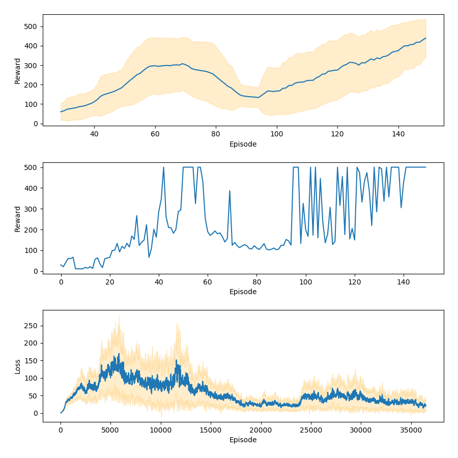

# Rapport TP DRL

**Etudiant :** Valentin Canete 11502374

## Cartpole

L'implémentation de l'environnment Cartpole avec un algorithme DQN était très instable au début, ce qui rendait les résultats mauvais.
J'ai testé deux fonctions d'optimisations, Adam et RMSProp, et RMSProp était plus efficace.
Pour la fonction de perte d'erreur, MSE était plus efficace comparé à la fonction Huber.

Pour rendre le DQN plus stable, j'ai rajouté un e-greedy avec du decay, partant de 0.9 et termine à 0.1 durant l'entraînement.
De plus, j'ai fais en sorte que lorsque l'agent obtient une moyenne de reward supérieur à 475 sur les 10 derniers épisodes, l'entraînement s'arrête.

Il y a ensuite une phase de test, qui teste l'agent sur 100 épisodes. Le test est arrivé si l'agent a plus de 475 de rewards en moyenne.

Les différents résultats de la recherche d'hyperparamètres sont disponibles dans le dossier /fig, classé entre ceux qui réussissent le test et ceux qu'ils ne le passent pas.

Deux entraînements avec des hyperparamètres similaires peuvent présenter des résultats différents, mais il semble que les hyperparamètres suivants conduisent à de bons scores : 
- Learning rate : .01
- Taille des couches : 8
- Gamme : .99
- Batch size : 256
- Update_target : 10 (fréquence de l'update du réseau qtarget)

**Graphes d'entraînements qui ont passé le test :**
*(Le x de la figure est le nombre d'itérations, pas d'épisodes)*

*lr=0.01_hidden=8_gamma=0.999_batchsize=256_steptarget=100*

*lr=0.01_hidden=8_gamma=0.99_batchsize=256_steptarget=10*

## Breakout

L'implémentation du DQN pour les environnements Atari n'est pas si différente. Il faut rajouter un CNN pour pouvoir traiter les images. Il y a aussi les wrappers, qui ont implémenté de manière identique au papier *Human-level control through deep reinforcement learning*.
La différence se fait surtout dans la gestion des ressources, qui m'a longtemps posé problème. D'abord implémenter un stockage plus efficace pour l'expérience-replay, en ne stockant que le state et non le next-state, car on peut le retrouver plus facilement.
Ensuite les temps de calculs sont très longs afin d'avoir le moindre résultat. Sur beaucoup des premiers essais, il fallait 10 à 15h de calculs pour voir l'agent arrive vers les 10 de scores.

J'ai du coup essayer d'accélerer la converge de l'agent, ce que je n'ai pas réussi aujourd'hui.
J'ai implémenté le Double Q Learning et le Dueling qui n'améliorent pas vraiment les résultats.

AJOUT 07/01 : Après une modification des wrappers et un entraînement plus long, le dqn avec doubleq et dueing arrive a de bons résultats avec notemment la technique du tunnel. 

J'ai repris une implémentation de Rainbow que j'ai trouvé sur internet, qui présente des résultats plus convaincants, comme le montre le graphique ci-dessous. Néanmoins, en comparant les résultats que j'ai par rapport aux graphes qu'on peut voir sur différents dépôts git, je pense qu'on peut obtenir une progression plus linéaire.

Ainsi, l'implémentation de Rainbow est la seule qui m'a donné des résultats pour l'instant avec une moyenne de 75 de scores en évaluation. Le seul bémol est que je n'ai pas implémenté de stochasticité en début d'épisodes, donc le comportement de l'agent est toujours similaire.

## La suite

Suite à ces résultats, il reste encore du travail à faire :

- Effectuer une meilleure recherche d'hyperparamètres, surtout pour le DQN, afin d'avoir de vrais benchmarks.
- Effectuer des entraînements beaucoup plus longs.
- Implémenter un rainbow un peu plus personnal afin de mieux le comprendre.
- Implémenter d'autres algorithmes (A3C, DRQN, DDPG) afin d'avoir un état de l'art sur les algorithmes de RL.
- Essayer d'implémenter des articles qui sont juste publiés.
